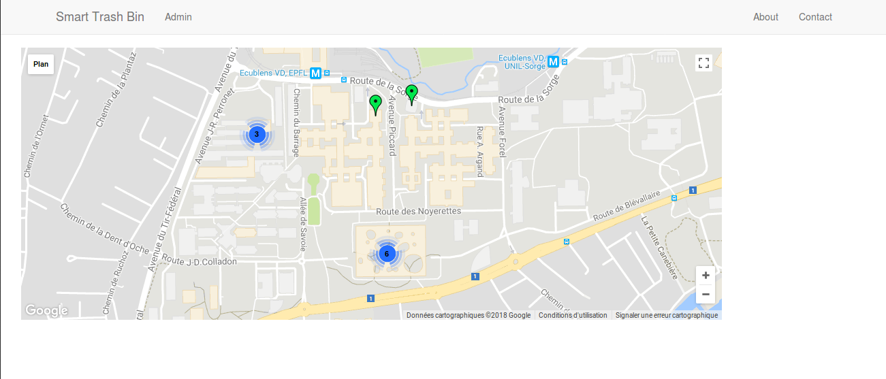
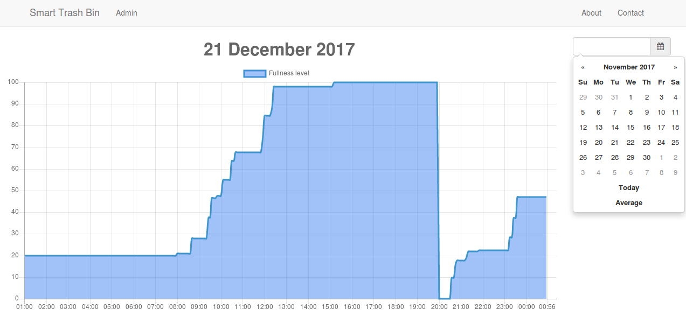

# Smart Trash Bin

 

This is a web app as part of the project for the product design course (Yves Bellouard at EPFL). This repository contains the code for both the web app and the code for the ESP32 microcontroller embedded in our smart trash bin.
This web app shall receive data from "Smart" trash bins, process it and provide some visualisations and predictions, in order to help EPFL cleaners.
We use Django for the back-end (Server side of the app), which is a python framework for developping web apps, and Bootstrap for the front-end (client side), which is good for handling screens with different formats (responsive design).
The communication between the ESP32 and the server is made via a REST API, detailled [here](SmartTrashBin/SmartTrashBin/map/api/CONTRIBUTING.md).
For a showcase how the web app, watch the [webapp.mp4](webapp.mp4).

## Getting Started

### Installing

Refer to Section "Start working on the app" of [CONTRIBUTING.md](CONTRIBUTING.md) for how to setup the web app and run the development server. (The web app is not hosted online yet) 

## Deployment

When deploying the app into production:
* Don't forget to disable the DEBUG option in the Django settings
* Change to a more scallable database if necessary (for ex: PostgreSQL)
* Use an appropriate server (for ex: Apache)

## Built With

### Web App

* [Django](https://www.djangoproject.com/) - Back-end web framework
* [Bootstrap](http://getbootstrap.com/) - Front-end toolkit
* [Google Maps API](https://developers.google.com/maps/web/) - Display maps
* [Chart.js](http://www.chartjs.org/) - Draw fullness graph

### ESP32 code

* [Espressif IoT Development Framework (ESP-IDF)](https://esp-idf.readthedocs.io/en/latest/) - C development libraries

## Contributing

Please read [CONTRIBUTING.md](CONTRIBUTING.md) for details on our code of conduct, how the app works and how to get started.

## Authors

* **Thomas Havy** - Web App
* **Matthieu Dujany** - ESP32 code

## License

This project is licensed under the MIT License - see the [LICENSE.md](LICENSE.md) file for details
